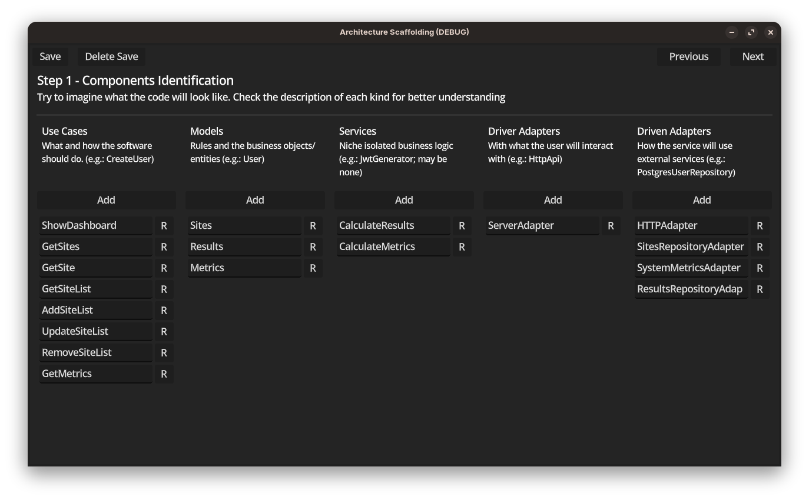
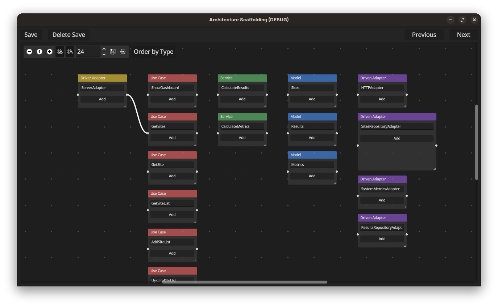

# Architecture Scaffolding

A tool for scaffolding projects using Hexagonal Architecture (or similar architectural styles), built with Godot.

Unlike most code generators, it provides a graphical workflow that helps developers refine and visualize their architecture before generating code. The application includes a 2D canvas for spatially organizing components and relationships.

> Disclaimer: This project used AI for guiding, learning, and controlled code generation. No decision were made without human analysis and intervention.

## Workflow

### Step 1 - Identify Components

Define the project's core components:

- Use Cases
- Models
- Services
- Driver Adapters
- Driven Adapters

> Describe how you expect the codebase to be structured. At this stage, only components are defined, no relationships or interfaces.

The tool then generates a visual representation of the components on a 2D canvas.

### Step 2 - Define Structure

Refine the architecture by adding:

- Relationships between components
- Interfaces (methods and properties)
- Model properties
- DTOs

The tool converts the canvas into a structured project representation.

### Step 3 - Generate Output

Generate:

- `architecture.md`
- Project files
- Boilerplate code
- Mermaid diagrams

## Installation

### Requirements

- Godot 4.x

### Steps

1. Open Godot.
2. Import the project.
3. Select the extracted repository folder.
4. Open the project.
5. Press **F5** to run.

## Planned Output Targets

- Go
- Python
